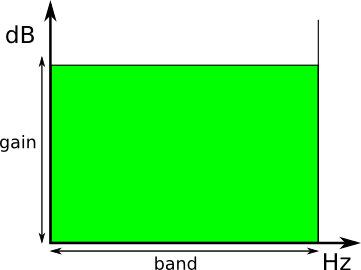
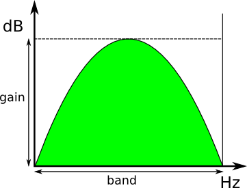
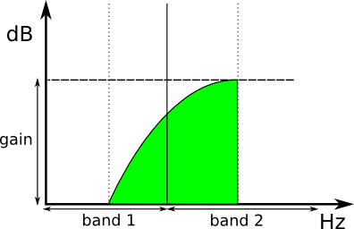

Band equalizer using FFT
========================

Introduction
------------
This project is an implementation of a simple band equalizer, with specifiable number of bands controllable by user, with usage of Fast Fourier Transform in C language. Input can be either raw data or sound file in WAV format, the same applies for output.

INSTALLATION
------------
After you download the git repository, simply write:

     make

For the purpose of plotting the graphs, you also need to install gnuplot on your system (see gnuplot in [Links](#links) section for official web page).

Usage
-----
```
Usage: ./befft -f in_file [-w] [-r denom] [-k list] [-d level]
   -f in_file: set the name of an input file to "in_file"

   -w:         input file is in WAV format

   -r denom:   set Octave bands control to [1/denom] (must be in range [1; 24] by standard ISO)
        (default value is 1)

   -k list:    list defines configuration of virtual knobs separated by commas, every knob has 3 properties:
        band range:  either one integer representing specific band, or two integers with character '-' in between,
                     to define range of bands, valid band ID value depends on choosen Octave fraction (-r option)
        function:    must be one of "f" for Flat, "p" for Peak, or "n" for Next
        gain:        integer value from range [-24; 24] (in dB) with, or without its sign
        EXAMPLE:     -k 1f+20,7-9n-24,42p21 (use Flat function applied to the first band with gain 20dB,
                     then use Next function applied on bands 7,8 and 9 with gain -24dB, etc.)

   -d level:   changes debug level to "level", smaller value means more info
        (default value is 90, used range is [1; 100])
```

Octave and bands
----------------
Octave is term, which describes bands of frequencies in frequency domain of the input sound track. As well as usual octave, it holds that it has 2:1 ratio, thus moving from one band of this Octave to the next will result in a doubling of the frequency. All of its bands must cover full 20Hz to 20kHz, which are all usually human-hearable frequencies - notes. The starting frequency of an Octave is 1000Hz, the rest is derived from this center and also fraction, which specifies number of bands in Octave.

In this program, the fraction is in form 1/denom, and you can select desired denominator by an *-r* option. Bigger denominator means more bands in Octave. Commonly used are 1/3 (30 bands), 1/6 (60 bands) and 1/12 Octave. Maximum allowed is 1/24 Octave which has about 243 bands to controll.

Knob handling
--------------
After you select you desired Octave, you now have achieved some number of virtual knobs to handle. Every knob is connected to some Octave band, and it can be handled by an *-k* option (see specification above in [Usage](#usage) section).

Knob has some properties, which are:
 - **knob ID** - this specifies which knob will be adjusted
 - **gain** - as knob can be rotated, this virtual knob can have values from range \[-24; +24\], gain is in dB units
 - **modulation function** - how the gain should be performed
   - **flat** - This function adds the same gain to all samples in band, where it's being applied. It's the most simple one mostly used only on analog devices for equalization.

	
   - **peak** - This function is using quadratic polynomial for counting it's values, it's also mostly used on analog devices.

	
   - **next** - Next function is used only on digital equalizers, it doesn't modify the whole band, but it starts in the middle of selected band and reaches the max gain in the middle of next band. In this program, sinus function is used for implementation of it.

	

Windowing
---------
In *equalizer.c*, you can find three examples of window function, implemented are called **Planck**, **Tukey**, and **Hamming**. In this program, non of them is actualy used (using no advanced function is called using rectangular window function...), because of the fact, they need extra work to do, like handeling overlapping, etc. and after all, rectangular window is not that bad, it's certainly suitable for this application.

For further details about this functionality, see Window functions bellow in the [Links](#links) section.

Running tests
-------------
Test WAV sound files are located in *tests/* directory. Bash script named *tester.sh* has few commented tests and it will run the **befft** program to modify these files from *tests/* folder with predefined different settings.

Test sound files are either from [SoundBible](http://soundbible.com/), [MTG Github](https://github.com/MTG/sms-tools/tree/master/sounds), or they were created with GNU Octave.

Requirements
------------
 - **gnuplot** - used to simplify graphical output
 - **GNU Octave** - if you want to use generated raw data

Links
-----
 - Equalization guide
   - http://www.zytrax.com/tech/audio/equalization.html
 - Wave format specification
   - https://ccrma.stanford.edu/courses/422/projects/WaveFormat/
 - Window functions
   - http://en.wikipedia.org/wiki/Window_function#A_list_of_window_functions
   - http://edoc.mpg.de/395068
 - gnuplot
   - http://www.gnuplot.info
 - SoundBible
   - http://soundbible.com/)
 - MTG Github
   - https://github.com/MTG/sms-tools/tree/master/sounds
